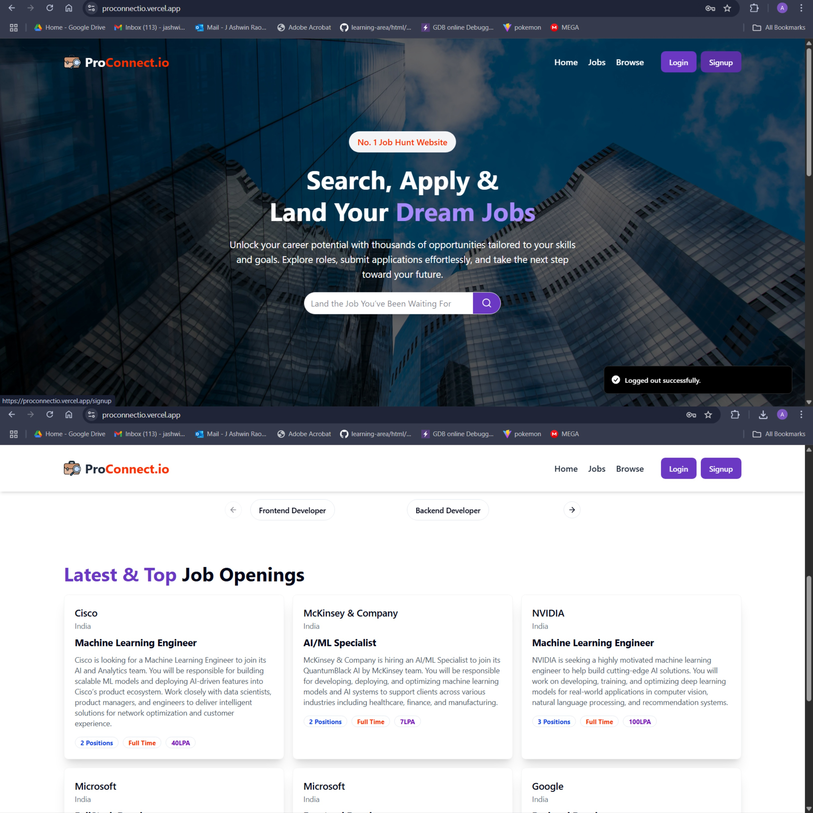
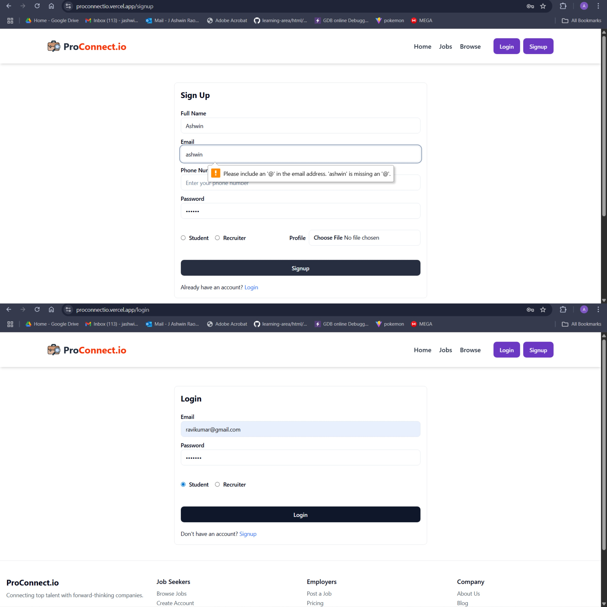
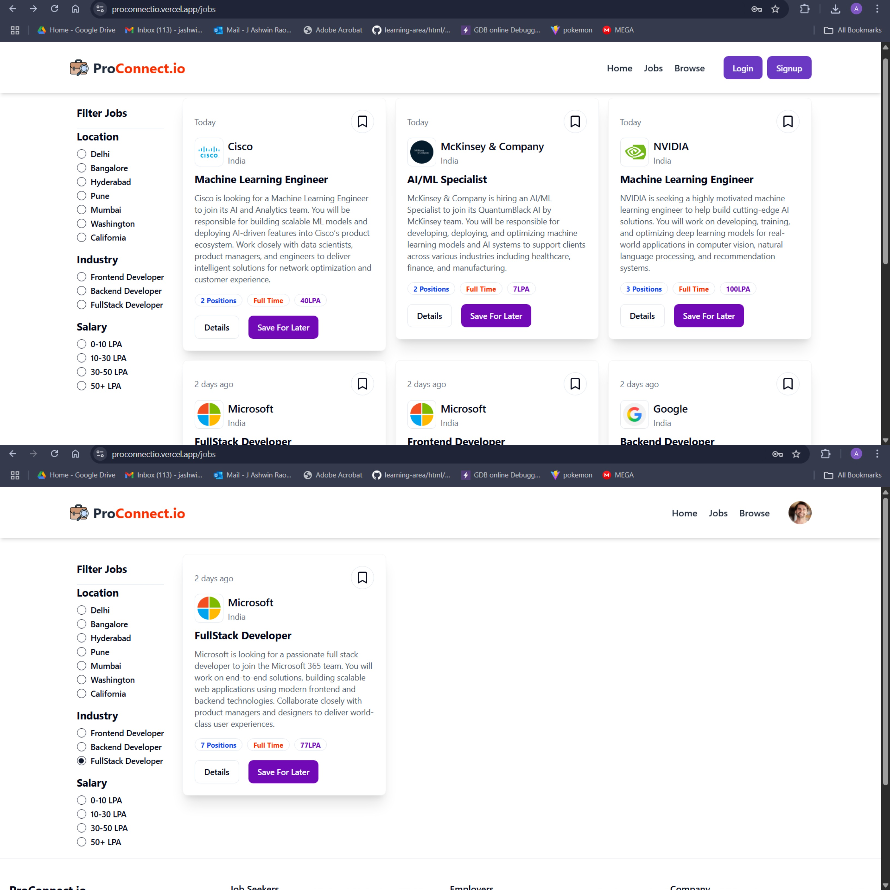
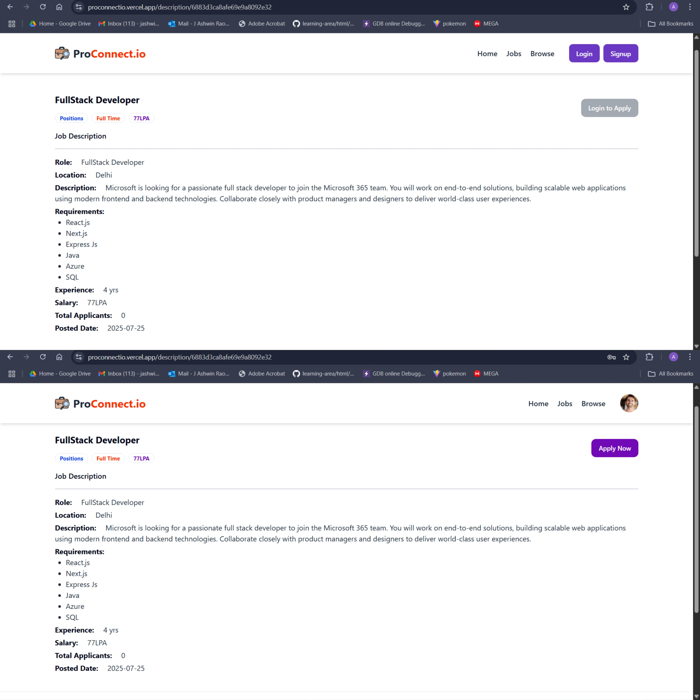
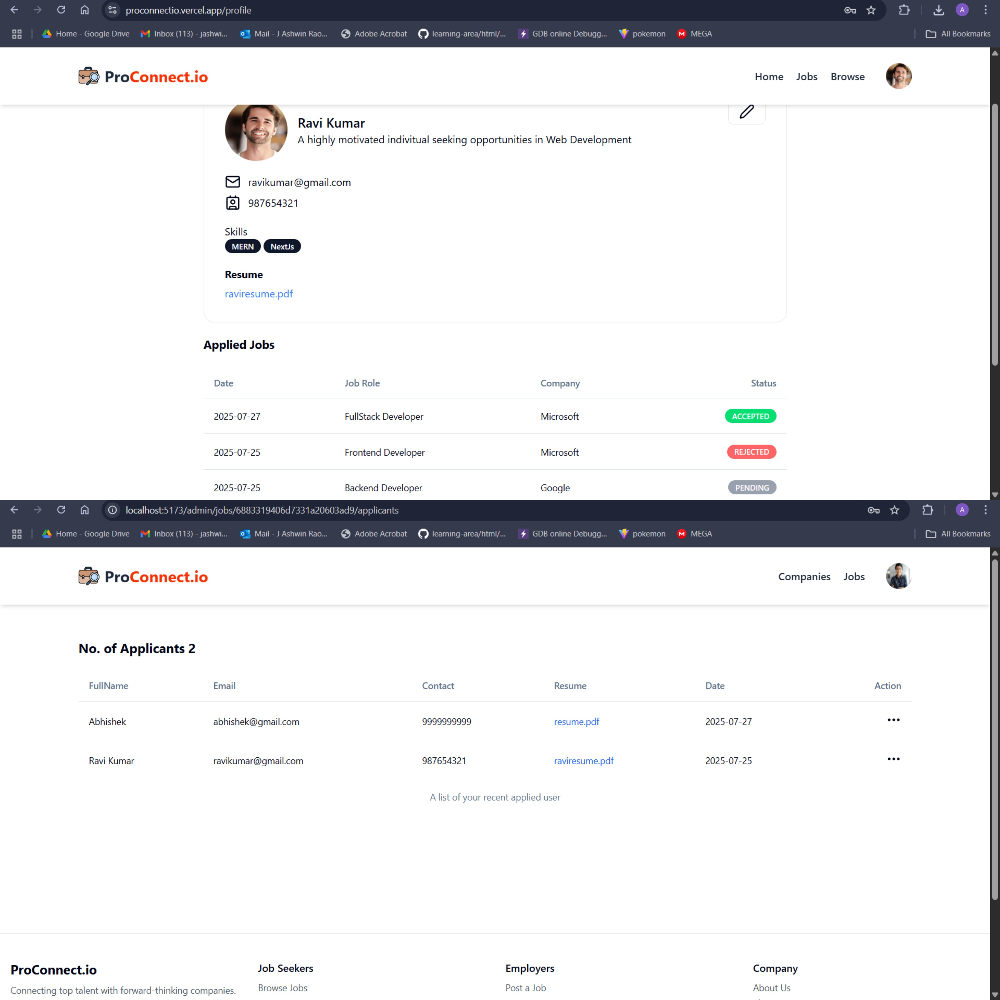
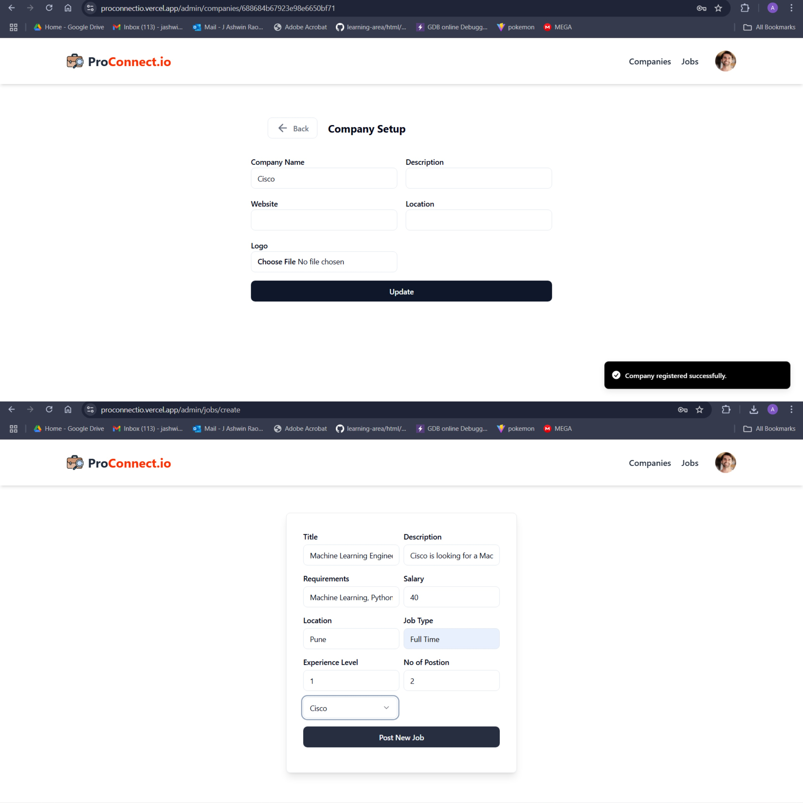
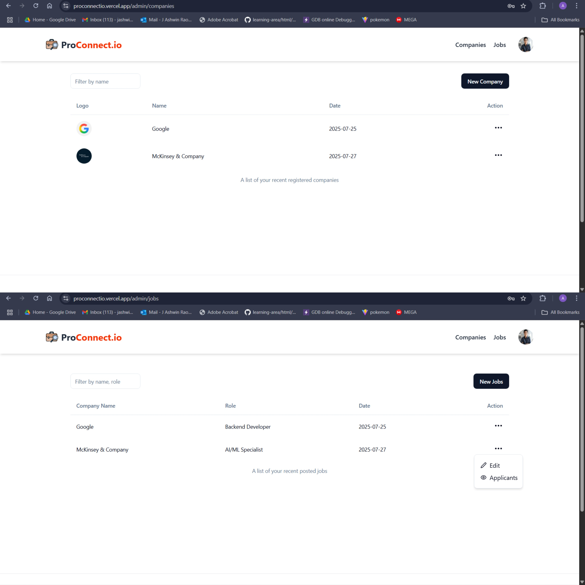

# 👔 ProConnect.io - Job Portal Platform

## 🚀 Live Demo
[https://proconnectio.vercel.app/](https://proconnectio.vercel.app/)

---

## 📌 Overview

**ProConnect.io** is a full-featured job portal platform that connects job seekers with recruiters. Built using the MERN stack, it provides a responsive, secure, and role-based experience for both students and recruiters. Students can browse and apply for jobs, while recruiters can post job listings and manage applications. Companies can also be added and associated with jobs.

---

## 📸 Screenshots

Below are some screenshots of the ProConnect.io platform in action:

---

## ✨ Features

### 👨‍🎓 For Students
- JWT-based login/signup
- Browse and search jobs by title, category, or location
- Apply to jobs and track applications
- Profile and resume upload (via Cloudinary)

### 🧑‍💼 For Recruiters
- Post and manage job listings
- Edit existing job posts
- Add and manage company profiles
- View all applications received
- Role-based access (Recruiter only)

### 🔐 Role-Based Access Control
- Roles: **Recruiter**, **Student**
- Protected API routes using JWT
- Cookies handled via `cookie-parser`

### 📂 File Upload
- Resume and company logos uploaded to **Cloudinary**
- Handled using **Multer** and **DataURI**

---

## 🛠️ Tech Stack

### 💻 Frontend
- React.js
- Tailwind CSS
- ShadCN/UI 
- Axios
- React Router DOM

### 🔧 Backend
- Node.js
- Express.js
- MongoDB with Mongoose ODM
- JWT for authentication
- Multer & DataURI for file handling

### ☁️ Cloud Services
- **Cloudinary** - Media and resume storage
- **Render** - Backend hosting
- **Vercel** - Frontend hosting

## 🛠️ Tech Stack

### 💻 Frontend
- React.js
- Tailwind CSS
- **ShadCN/UI** (modern UI components)
- Axios
- React Router DOM
- Redux Toolkit

### 🔧 Backend
- Node.js
- Express.js
- MongoDB + Mongoose
- JWT Authentication
- Cloudinary (Image Upload)
- Multer, DataURI

---

## 🧩 System Architecture

### 📦 Frontend
- Built with React + Tailwind
- Role-based routing and protected views
- ShadCN/UI for prebuilt modern UI components
- Axios for API calls
- Redux Toolkit for global state

### ⚙️ Backend
- REST APIs built with Express.js
- JWT-based auth middleware
- Cloudinary integration for image uploads
- MongoDB schema design with Mongoose

---

Deployment using Render and Vercel

